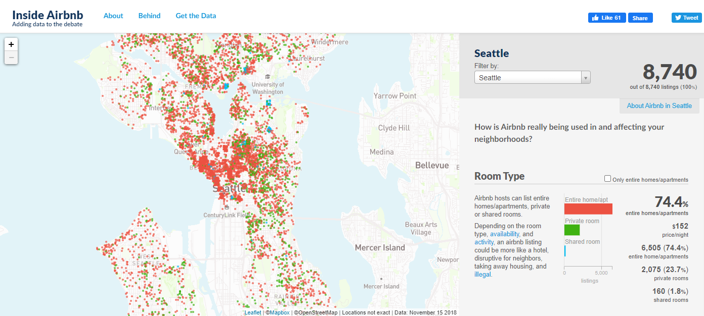
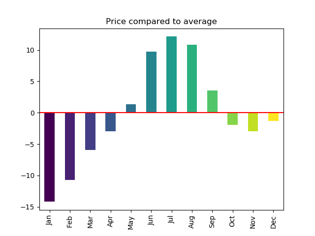
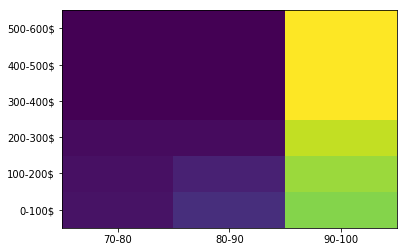

# Data Science - Mind the Gap!



One of the very first essential question, which comes to every __data scientist__ is how to handle missing data. There are several reasons why there is a lag of information, but there are even more ways how to deal with them - in other words to say how to close the gap!

This article faces the __airbnb database__ which contains a lot of reviews of vacations in __Seattle__. There are some values in the database which are not provided, which is perfect for demonstration purpose and challenges the way to receive some deeper insights.

> __Remark__  
For technical details on how to handle those missing database items, please have a look on my github account. You can find all statistical evaluations there, as well as the code base behind.

Just like in every vacation there are some questions, which come to everybody's mind before booking. In this article I want to give answers at least to three of those questions, based on the database evaluation:

- when should you travel?
- where should you stay?
- what to pay for the best trip?

## When to travel?
If you're flexible in time and you plan your next year's holydays, the first questions which arises will be 'when to travel' to Seattle? Of course, this is a great city but at which time period can you save the most money?



As you can see you can save up to nearly 15 Dollars, if you travel in __January__. On the opposite you have to pay about 10 Dollars above the average price from June to August. 

## Where to stay?
After your decision when to travel, the next questions which comes to your mind is where to stay exactly in Seattle? There are a lot of interesting areas, but where can the best reviews of all travelers be found?


The highest scores can be seen in the center of the city - especially one point stands out there. Since the scoring is defined as described below, areas near the center are scored higher as well.

```
    score = review / price - distance
```

The reason for considering the distance to center as well is that from there you save to most time, if you want to travel to any direction. Therefore, __zipcodes__ like __98102__ or __98101__ are scored the highest.

> __Remark__  
In the formula distance means actually the distance to the center of the city. 

## What to spend?
Since you already know when to travel to Seattle and where to stay exactly by know, the final question is how much money do you have to spend on in order to get the best experience in comfort of your stay.



As you can see you can already find some places in Seattle with ratings above 90 points in the price range of 0-100$. An interesting aspect is that, spending more than 400$ will not be more likely to get you a higher rated place than in the price range of __300-400$__.

All those results are evaluated by the airbnb database of several thousands of reviews. So if you are from Seattle or have been there for a while, maybe you can relate to the presented recommendations. Feel free to leave a comment if you share this point of view or even if you disagree.