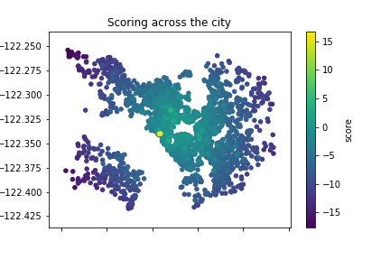

# Data Science - Mind the Gap!

One of the very first essential question, which comes to every __data scientist__ is how to handle missing data. There are several reasons why there is a lag of information, but there are even more ways how to deal with them. In this article I want to show __three strategies__ how to handle this issue and compare them afterwards.

- Excluding Data
- Default Values
- Imputing Data

In order to make it more interesting this article faces the __airbnb database__ which contains a lot of reviews. There are some values in the database which are not provided, which is perfect for demonstation purpose. All packages, which are requiered for this project can be found in the __requirements.txt__ file.

## Excluding Data
The first and easiest way how to handle missing data in this database is to exclude any item, which contains missing values. This might be neccessary for the some algorithms out of the field of machine learning in order to be able to learn, since they do not accept NaN values.

> __Remark__  
This naive strategy is very easy to use, but has some drawbacks as well. With this first approach we are receiving a __very small dataset__, which might be a challange to the training of a neural network.

## Default Values
The next idea increases the dataset, by filling missing values with default values. This can be done by taking zero or minus one for data types like int or float, but might me a challenge for cathegorical types like enums. 

> __Remark__  
This naive stategy of filling missing data has also some known drawbacks. With this approach some of the correlations in the data might get lost, which leads to __lower accuracy__ in future predictions.

## Imputing Data
In this section default values are taken no longer to be filled in for missing data, but more realistic values are taken into account. Therefore statistical values like the mean can be used as a filling strategy, which is much more realistic than plain default values.

> __Remark__  
This strategy has like all the others some drawbacks as well. Since we're still filling values with realistic but not neccesarry correct data, this might lead to __over-fitting__ in machine learning algorithms.

Since we're now able to handle databases with missing values for training neural networks, we're finally able to search to some correlations between different aspects of the data. 

Therefore feel free to visit my [article](...) on medium about the airbnb database. It shows how deeper insights can be taken with my previously presented filling strategies from the __jupyter notebook__ of this repository.

