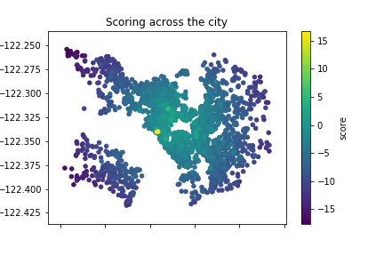

# What affects the Airbnb prices in Boston?

## Introduction

In this repository the airbnb dataset will be analyzed by the __CRISP-DM__ process, which is the standard way of how to tackle data science projects. The structure of the GitHub Repository is as it can be seen below.

### Files
- `README.md`: Landing page for GitHub.
- `Article.md`: Article on Medium Webpage.

### Folders
- `./dataset`: .csv files from Seattle Airbnb.
- `./images`: Plots from jupyter notebook.

### Requirements
- panda, numpy, matplotlib

## Motivation

One of the very first essential question, which comes to every __data scientist__ is how to handle missing data. There are several reasons why there is a lag of information, but there are even more ways how to deal with them. In this article I want to show __three strategies__ how to handle this issue and compare them afterwards.

- Excluding Data
- Default Values
- Imputing Data

In order to make it more interesting this article faces the __airbnb database__ which contains a lot of reviews. There are some values in the database which are not provided, which is perfect for demonstration purpose. All packages, which are required for this project can be found in the __jupyter notebook__ file at the beginning.

### Excluding Data
The first and easiest way how to handle missing data in this database is to exclude any item, which contains missing values. This might be necessary for  some algorithms out of the field of machine learning in order to be able to learn, since they do not accept NaN values.

> __Remark__  
This naive strategy is very easy to use but has some drawbacks as well. With this first approach we are receiving a __very small dataset__, which might be a challenge to the training of a neural network.

### Default Values
The next idea increases the dataset, by filling missing values with default values. This can be done by taking zero or minus one for data types like int or float but might me a challenge for categorical types like enums. 

> __Remark__  
This naive strategy of filling missing data has also some known drawbacks. With this approach some of the correlations in the data might get lost, which leads to __lower accuracy__ in future predictions.

### Imputing Data
In this section default values are taken no longer to be filled in for missing data, but more realistic values are considered. Therefore, statistical values like the mean can be used as a filling strategy, which is much more realistic than plain default values.

> __Remark__  
This strategy has like all the others some drawbacks as well. Since we're still filling values with realistic but not necesarry correct data, this might lead to __over-fitting__ in machine learning algorithms.

## Article on Medium

Since we're now able to handle databases with missing values for training neural networks, we're finally able to search to some correlations between different aspects of the data. 

Therefore, feel free to visit my [article](https://philipp-killermann.medium.com/data-science-mind-the-gap-258c95ba9af7) on medium about the airbnb database. It shows how deeper insights can be taken with my previously presented filling strategies from the __jupyter notebook__ of this repository.

In the jupyter notebook the following questions are answered in more details.

- Qestion: `When to travel to Seattle?` 
    - Answer: __January__
- Question: `Where to stay in Seattle?`
    - Answer: __98102__
- Question: `What to pay for in Seattle?`
    - Answer: __300-400$__

For the second question there is score function introducted, which looks like below. If you are interested in how the other answers were found, please have a look in the __jupyter notebook__. 

``` python
    score = rating / price - distance
```
> __Remark__  
In this context the distance in the forumula above discribes the distance to the __center of the city__.

You can see in the figure below the score across Seattle of all listings in the analyzed data set of Seattle. Hopefully this encourages you for reading  more in the provided notebook.



# Acknowledgements
Thanks to the __inside Airbnb__ Webpage for providing this data set, which enables data scientist a very easy access to real world data.
